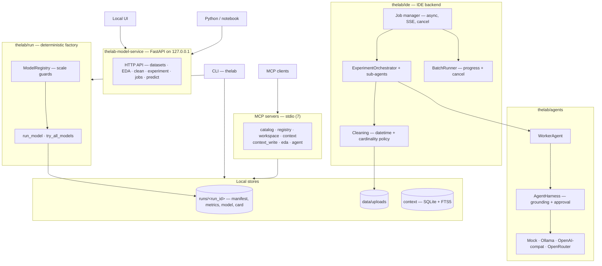

# The Lab — Context-Aware Multi-Agent Orchestration via MCP

**An autonomous ML factory built on the Model Context Protocol.**
Bachelor thesis (TFG) at **Universidad Carlos III de Madrid**, Data Science and Engineering.

> **Status:** P0 → P2 complete. Deterministic core, agent orchestration, and agentic IDE all implemented, tested, and audited.

## What it is

The Lab is a local-first machine-learning factory that turns a tabular CSV into a versioned, validated, locally served model — with every step executed by specialized agents over the Model Context Protocol, every decision recorded as typed evidence, and every artifact reproducible from a persisted seed and configuration.

Three properties define the system:

1. **Context-aware.** Every run, decision, error, and artifact reference is stored in a local, searchable context (SQLite + FTS5). Agents ground their proposals in this context — prior runs, EDA findings, experiment history — instead of guessing.
2. **Multi-agent orchestration.** A `WorkerAgent` proposes experiments; an `ExperimentOrchestrator` runs specialized sub-agents (EDAAnalyst, FeatureEngineer, ModelSelector) through a deterministic pipeline with explicit human approval boundaries.
3. **MCP-native.** Datasets, models, artifacts, context, EDA, and orchestration are all exposed as typed MCP tools. An independent MCP client can discover a trained model and request predictions without knowing anything about the training pipeline.

## Concept → evidence map

| Thesis concept | Implementation | Where to look |
|---|---|---|
| Typed contracts | `TaskSpec`, `RunManifest`, `ArtifactRef`, `DatasetSpec`, `ModelSpec`, `LogEntry` (Pydantic) | `thelab/contracts/` |
| Deterministic factory | `thelab run model` with fixed seed → full artifact set | `thelab/run/` |
| Validation as outcome | Approved/rejected runs with stored reasons | `thelab/run/validate.py` |
| Multi-agent orchestration | `WorkerAgent`, `ExperimentOrchestrator` + sub-agents, approval records | `thelab/agents/`, `thelab/ide/orchestrator.py` |
| Context store & retrieval | SQLite + FTS5, redaction, privacy levels | `thelab/context/` |
| MCP servers | 7 stdio servers (catalog, registry, workspace, context, context-write, EDA, agent) | `thelab/mcp/` |
| Local model service + UI | FastAPI dashboard, Experiment panel, SSE live runs | `thelab/model_service/` |
| Sandboxed agent iteration | AST-restricted Python subprocess for agent-generated code | `thelab/sandbox/` |
| Thesis evaluation | Automated RQ1–RQ3 evaluator | `scripts/evaluate_thesis.py`, `docs/THESIS_EVALUATION.md` |

## Quick start

```bash
python3 -m venv .venv
source .venv/bin/activate
pip install -r requirements.lock
pip install -e .
```

**The UI path (autonomous factory):**

```bash
thelab-model-service            # open http://127.0.0.1:8000
```

Upload a CSV → run EDA → Clean dataset → **Experiment panel**: describe a goal, start the run, watch sub-agents work live (Plan → Clean → Train → Evaluate), send feedback to iterate, compare history.

**The deterministic path (no LLM, no UI):**

```bash
thelab run model --dataset examples/iris.csv --target species \
  --model logistic_regression --seed 42 --output runs
```

**The MCP path (independent client):**

```bash
thelab-mcp-demo model_registry --run-id <run_id>   # list_models + predict
thelab-mcp-demo data_catalog --run-id <run_id>
thelab-mcp-demo context
```

## Datasets

- **Iris fixture** (`examples/iris.csv`) — the deterministic baseline mandated by the P0 spec; proves reproducibility end-to-end.
- **S&P 500 analyst ratings** (~164k rows, real-world) — the realism benchmark: datetime columns, high-cardinality categoricals, missing targets, leakage structure. Used to demonstrate scale behavior and traceable rejection of incompatible configurations.

## Documentation

| Doc | Purpose |
|---|---|
| [`docs/THESIS_MAP.md`](docs/THESIS_MAP.md) | Concept → implementation → demo mapping with reproduction commands |
| [`docs/THESIS_EVALUATION.md`](docs/THESIS_EVALUATION.md) | RQ1–RQ3 protocol and recorded results |
| [`docs/ROADMAP.md`](docs/ROADMAP.md) | Global roadmap: P0 → P1 → P2, current focus |
| [`docs/USER_GUIDE.md`](docs/USER_GUIDE.md) | How to use the app: UI, CLI, HTTP API, MCP |
| [`docs/CLI_GUIDE.md`](docs/CLI_GUIDE.md) | CLI reference |
| [`docs/PYTHON_API.md`](docs/PYTHON_API.md) | Python/notebook API |

Historical slice/phase records live in [`docs/legacy/`](docs/legacy/) — source
material for the thesis document, not binding for new code.

## Architecture

One deterministic pipeline, three ways in. The UI and Python talk to the
HTTP service; MCP clients talk to the stdio servers; the CLI drives the
factory directly. Everything lands in the same auditable local stores.



The flow for one experiment: **UI → HTTP API → job manager → orchestrator →
(agents for planning) → BatchRunner → `run_model` → artifacts**. The MCP
servers read the same stores, so an independent client can discover and use
what the UI produced — that is the thesis interop claim.

## Tests and verification

```bash
ruff check thelab tests scripts
mypy thelab
pytest tests/ -q
python scripts/evaluate_thesis.py
```

## Safety and limitations

Local-first by design: default bind `127.0.0.1`, no cloud services, secrets redacted before storage, approvals recorded with principal and timestamp. Known boundaries are documented, not hidden: the code sandbox provides compute isolation (documented in `docs/legacy/P2_AUDIT.md`), sub-agents execute in-process, and incompatible datasets are rejected as traceable outcomes.

## Author

**Arturo Kolster Borges** · Universidad Carlos III de Madrid · Data Science and Engineering (2022–2026)

## License

[MIT](LICENSE)