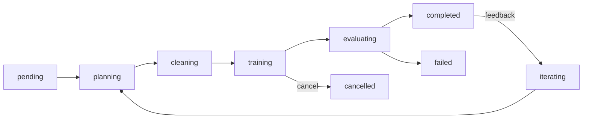

# Thesis Map — Concepts, Evidence, Demos

> This document maps every concept in the thesis title to its implementation, the tests that prove it, and a reproduction command. It is the bridge between the thesis narrative and the repository.

**Thesis:** *Context-Aware Multi-Agent Orchestration via MCP — an autonomous ML factory built on the Model Context Protocol.*
**Institution:** Universidad Carlos III de Madrid (UC3M), Data Science and Engineering.

---

## RQ mapping

The thesis answers three research questions, each automated in `scripts/evaluate_thesis.py`:

| RQ | Question | Automated check |
|---|---|---|
| RQ1 | Can a model-training run be reproduced from dataset + config + seed? | Two identical trains; metrics match; manifest carries seed + dependency versions |
| RQ2 | Can an independent MCP client discover and use a model? | Spawns `model_registry_mcp`; `list_models` + `predict` round-trip |
| RQ3 | Can local context retrieval recover useful past evidence? | Index JSONL → search hit → DB byte-identical after read |

Current status: **PASS** (see `docs/THESIS_EVALUATION.md`).

---

## Concept 1 — Autonomous ML factory

**Claim:** a tabular CSV becomes a versioned, validated, locally served model with no manual steps.

| Evidence | Location |
|---|---|
| Deterministic pipeline (validate → profile → contract → train → validate → register) | `thelab/run/runner.py` |
| Full artifact set per run (`manifest.json`, `metrics.json`, `model_card.md`, …) | `thelab/run/artifacts.py` |
| Batch/try-all model comparison | `thelab/run/batch.py`, `thelab/run/runner.py` |
| Background job execution with SSE progress | `thelab/ide/jobs.py` |

**Demo (deterministic, no LLM):**

```bash
thelab run model --dataset examples/iris.csv --target species \
  --model logistic_regression --seed 42 --output runs
thelab predict --run-id <run_id> --features '{"sepal_length": 5.1, "sepal_width": 3.5, "petal_length": 1.4, "petal_width": 0.2}'
```

**Claim demonstrated:** re-running the command yields a new `run_id` with equivalent metrics; `manifest.json` proves the seed/config/dependency provenance.

---

## Concept 2 — Context-aware agents

**Claim:** agents ground decisions in a local, redacted, searchable context rather than free-form chat.

| Evidence | Location |
|---|---|
| SQLite + FTS5 store, SHA-256 fingerprinting, secret redaction | `thelab/context/` |
| Read-only retrieval (`mode=ro`, `query_only=ON`, privacy filtering) | `thelab/context/reader.py` |
| Worker proposals grounded in EDA + prior-run metrics | `thelab/agents/worker.py` (`_find_prior_runs`, `_build_eda_rationale`) |
| Agent activity logging with redaction | `thelab/mcp/context_write_mcp.py` |

**Demo:**

```bash
thelab context index --source .thelab/local-logs/agent-events.jsonl
thelab context search "proposal"
thelab-mcp-demo context
```

---

## Concept 3 — Multi-agent orchestration

**Claim:** specialized agents (EDAAnalyst, FeatureEngineer, ModelSelector) collaborate through typed artifacts with human approval boundaries.

| Evidence | Location |
|---|---|
| Sub-agent prompt contracts | `thelab/ide/sub_agents.py` |
| Orchestration loop (EDA → clean → try-all → approved batch training) | `thelab/ide/orchestrator.py` |
| Experiment state machine (`pending → planning → … → completed`) | `thelab/ide/experiment.py` |
| Approval records (`principal`, timestamp) | `thelab/agents/worker.py` (`ProposalStore`) |
| Agent harness + provider abstraction (mock, Ollama, OpenAI-compatible, OpenRouter) | `thelab/agents/` |

**Demo (UI):** `thelab-model-service` → Experiment panel → start a run on an uploaded dataset → watch stage pipeline and agent activity stream (SSE) → send feedback to iterate → compare in History.

Experiment lifecycle (persisted state machine):



---

## Concept 4 — MCP interoperability

**Claim:** an independent MCP client can use the factory without knowing its internals.

| Evidence | Location |
|---|---|
| 7 stdio MCP servers | `thelab/mcp/*.py` (entry points `thelab-*-mcp`) |
| Tool schemas with bounds and `additionalProperties: false` | `thelab/mcp/context_mcp.py`, `agent_mcp.py` |
| Demo client exercising servers end-to-end | `thelab/mcp/demo_client.py` |

**Demo:**

```bash
thelab-mcp-demo model_registry --run-id <run_id>   # list_models, get_model_card, predict
thelab-mcp-demo data_catalog --run-id <run_id>     # datasets, profiles, contracts
```

---

## Concept 5 — Real-world robustness (the honest boundary)

**Claim:** the factory behaves gracefully on real data — incompatible configurations are rejected traceably, never silently wrong.

| Evidence | Location |
|---|---|
| Validation failures are first-class outcomes | `thelab/run/validate.py`, PRD AC-02 |
| Cleaning policy: datetime parsing + cardinality-aware encoding + audit report | `thelab/ide/cleaning.py` |
| Per-model scale guards (rejection instead of multi-hour runs) | `thelab/run/model_registry.py`, `thelab/run/runner.py` |
| Cooperative job cancellation + per-model progress events | `thelab/ide/jobs.py`, `thelab/run/batch.py` |
| Documented limitations (sandbox isolation, in-process sub-agents) | `docs/legacy/P2_AUDIT.md`, `docs/legacy/P2_PHASE6_CONTEXT.md` |

**Recorded results — S&P 500 analyst ratings (164,231 rows × 18 columns, real downloaded dataset):**

| Step | Result | Time |
|---|---|---|
| Cleaning policy | 164,231 → 113,769 rows, 18 → 32 columns (datetime parsed, 501 tickers / 306 firms frequency-encoded), full `cleaning_report` | 6.3 s |
| **Before/after the policy** | naive one-hot cleaning produced a **22 GB** CSV; the policy writes **16–21 MB** for the same dataset | — |
| Feature-horizon leakage demo | naive feature set 84.2% accuracy → at-decision-time features **60.3%** (domain-plausible); all three runs traceable | ~1 s each |
| Scale guard | `svc` on 113,769 rows → `rejected` with reason in 0.1 s (was: hours or OOM) | 0.1 s |
| Full orchestrated experiment (API) | 3 models × 3 seeds = 9 persisted runs; best `random_forest` **74.9% test accuracy**; per-model progress events; experiment `completed` | 121 s |

**Demo:** upload the S&P CSV → EDA → Clean (report shows every action) → Experiment panel → watch stages + per-model events → inspect best run metrics in History.

---

## Current focus

Updated as work progresses — no fixed timeline; we iterate fast and the
present is what counts.

- [x] Real-dataset hardening: cleaning policy (datetime + cardinality), model
      scale guards, per-model progress, job cancellation — S&P dataset runs
      end-to-end (`tests/test_real_data_hardening.py`)
- [x] Documentation set: README + architecture diagram, user guide (UI / CLI /
      API / MCP), global roadmap, codebase guide rebalance
- [ ] Cross-dataset benchmark recorded (iris, titanic-class, S&P) via the B1
      harness scripts
- [ ] D1 demos: notebook + scripted demo (direct run → MCP → context search)
      on both fixture and real datasets
- [ ] Agent-connected evaluation: experiments driven through Ollama /
      OpenRouter providers, not only the deterministic fallback
- [ ] Fresh-venv install verification + demo rehearsal before submission